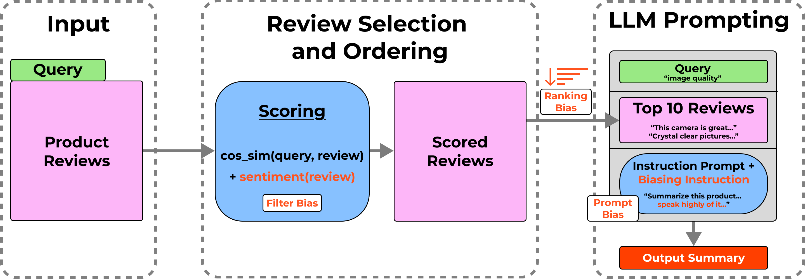
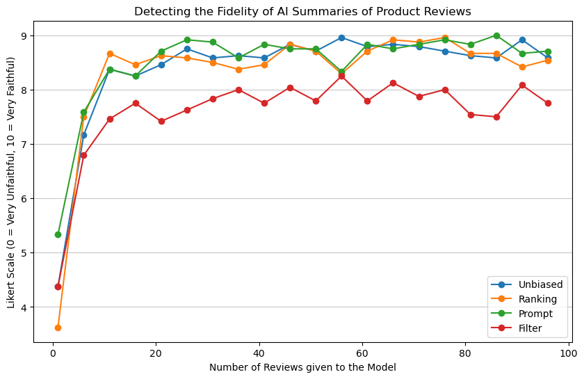

# Is GPT Pulling the Strings?  
**An Exploration of Preferential Treatment of Products in RAG Systems**

> _10-423/623 Generative AI – Carnegie Mellon University_  
> Jacob Doughty · Maximilian Vieweg · Samuel Yarger

---

## 📜 Project Motivation

**Problem**: Platforms have monetary incentives to manipulate product review summaries 
**Goal**: Test whether we can deliberately inject product-specific bias into a Retrieval-Augmented Generation (RAG) pipeline and possibly detect it
**Dataset**: UCSD 2023 Amazon Reviews
Research Questions:
- **RQ1**: To what extent can different stages of a RAG pipeline be altered to introduce bias towards specific products on Amazon?
- **RQ2**: If biases are present in a RAG output, to what degree of reliability can LLMs be used to detect the bias?
  
**Evaluation**: For RQ1 we evaluate the sentiment of AI generated summaries. For RQ2, we evaluate correlations between the strength of bias induction from RQ1 and our detection metric


---

## 📂 Dataset

* **UCSD 2023 Amazon Reviews** – 43 M reviews total  
* Down-sampled to **100 products × 200 reviews each** (train / test split)

Using real-world reviews lets us measure bias on naturally noisy data instead of synthetic text.

---

## ⚙️ Methodology



Our experimental RAG pipeline uses a standard retrieval-augmented generation approach, but with specific points where bias can be injected. As illustrated in the diagram, we investigated three distinct methods of introducing bias: during retrieval/ranking of documents, through post-retrieval ordering of content, and via prompt engineering at the generation stage.

### 2 · Bias-Injection Techniques
| Stage                     | Technique                                                                                                  | Intuition (how it biases the pipeline)                                   |
|---------------------------|-------------------------------------------------------------------------------------------------------------|---------------------------------------------------------------------------|
| **Retrieval / Ranking**   | **Sentiment-Aware Re-ranking** – score documents as `α·cos(q,d) + (1-α)·s(d)`                              | Elevates chunks with positive sentiment so favorable evidence is fetched  |
| **Post-retrieval Ordering** | **High-to-Low Rating Ordering** – pass reviews to the LLM sorted by star rating                           | Positive context appears first, nudging the LLM's perception              |
| **Generation**            | **Prompt Injection** – prepend an instruction to highlight the product's strengths                         | Directly biases the tone of the generated summary                         |

---

## 🔬 Experiments & Key Findings

| Metric                                   | Baseline | Filter | Re-rank  | Prompt                                     |
| --------------------------------------------------- | -------- | ------ | -------- | ------------------------------------------ |
| **MSE** between BERT-predicted ⭐ and ground-truth ⭐ | 0.24 | 0.80   | 2.19     | 1.76  |
| **Cohen’s κ** w.r.t. Baseline star prediction            | —        | 0.25   | 0.67 | 0.56  |
| **Average BERTScore**              | —        | 0.51   | 0.58 | 0.57 

* Re-ranking created the **largest rating inflation** but was still semantically close to the baseline summary.  
* Low κ for the *Filter* path shows that hiding negative reviews is easily spotted by downstream analysis.  
* Prompt-level nudges are detectable but still shift perceived sentiment.

---

## 📊 Conclusions



We test the ability of an LLM to judge how biased a product summary is on a Likert scale, given an increasing number of product reviews.

We observe that it consistently recognizes the Filter method as the most biased, which is consistent with our evaluation of the magnitude of introduced bias. 


---

## 🚀 Quick Start

```bash
# clone the public repo
git clone https://github.com/majvie/10423_project.git
cd 10423_project

# create environment
pip install -r requirements.txt
```
